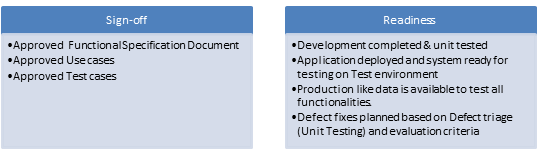
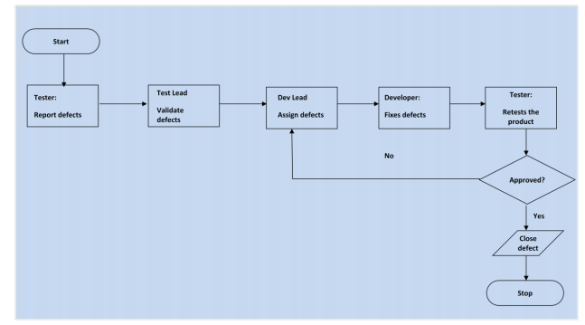

**Data Generator Test Plan**

**Release: 1.0**

**August 29, 2017**

Test Plan
================

**Revision history**

+----------------+--------------+--------------+----------------+
| **Revision**   | **Date**     | **Author**   | **Comments**   |
+================+==============+==============+================+
| 1.0            | 29/08/2017   | Kasia G.     |                |
+----------------+--------------+--------------+----------------+
| 2.0            | 06/09/2017   | Patryk B.    |                |
+----------------+--------------+--------------+----------------+
| 3.0            | 15/09/2017   | Patryk B.    |                |
+----------------+--------------+--------------+----------------+

1.Identifier
------------

This is a test plan for data generator. The document provides the
framework for the duration of test and cost of test execution
estimation.

2. Introduction 
---------------

This test plan describes the testing approach and overall framework that
will drive the testing of the Data Generator. It will have an influence
on tasks related to test planning, test scripts and test execution.

2.1 Test scope
~~~~~~~~~~~~~~

All functional and non-functional requirements written in
SRS-Requirements must be achieved.

2.2 Test environment 
~~~~~~~~~~~~~~~~~~~~

This application will operate on 3 most common OSes, such as: Windows,
macOS, UNIX- Linux. In version 1.0 application will work on Linux OS. So
v1.0 will be tested on Ubuntu 16.04.3 LTS, which is the same as
production environment. Things which need to previously prepared are
Python min. 3.\*.\*.

3. Roles and responsibilities
-----------------------------

Below the groups which take part in project testing process are defined:

**Sprint 2:**

+---------------------------+--------------------------+--------------------------------------------------------+
| **Name**                  | **Role**                 | **Responsibilities**                                   |
+===========================+==========================+========================================================+
| -  Katarzyna Fedevych     | Project leader           | -  manages resources in whole project                  |
|                           |                          |                                                        |
|                           |                          | -  controls the flow of the communication              |
|                           |                          |                                                        |
|                           |                          | -  plans and execute activities                        |
+---------------------------+--------------------------+--------------------------------------------------------+
| -  Katarzyna Grzywacz     | Test Leader              | -  controls the flow of the communication in QA team   |
|                           |                          |                                                        |
|                           |                          | -  evaluates the test results                          |
+---------------------------+--------------------------+--------------------------------------------------------+
| -  Daria Radoszewska      | Quality Assurance Team   | -  performs tests                                      |
|                           |                          |                                                        |
| -  Patryk Bogusz          |                          | -  develops test plan and test cases                   |
|                           |                          |                                                        |
| -  Katarzyna Grzywacz     |                          | -  writes and executes automated tests (if needed)     |
|                           |                          |                                                        |
| -  Teresa Bury            |                          | -  prepares test cases                                 |
+---------------------------+--------------------------+--------------------------------------------------------+
| -  Mateusz Grabon         | Develop Lead             | -  static code review                                  |
|                           |                          |                                                        |
|                           |                          | -  mentoring                                           |
+---------------------------+--------------------------+--------------------------------------------------------+
| -  Szymon Bieniek         | Developers Team          | -  performs unit tests                                 |
|                           |                          |                                                        |
| -  Patrycja Brzeska       |                          | -  develop all functionality of the application.       |
|                           |                          |                                                        |
| -  Michal Cieslar         |                          |                                                        |
|                           |                          |                                                        |
| -  Katarzyna Fedevych     |                          |                                                        |
|                           |                          |                                                        |
| -  Mateusz Grabon         |                          |                                                        |
|                           |                          |                                                        |
| -  Aleksandra Sucharska   |                          |                                                        |
+---------------------------+--------------------------+--------------------------------------------------------+

**Sprint 1:**

+---------------------------+--------------------------+--------------------------------------------------------+
| **Name**                  | **Role**                 | **Responsibilities**                                   |
+===========================+==========================+========================================================+
| -  Katarzyna Fedevych     | Project leader           | -  manages resources in whole project                  |
|                           |                          |                                                        |
|                           |                          | -  controls the flow of the communication              |
|                           |                          |                                                        |
|                           |                          | -  plans and execute activities                        |
+---------------------------+--------------------------+--------------------------------------------------------+
| -  Katarzyna Grzywacz     | Test Leader              | -  controls the flow of the communication in QA team   |
|                           |                          |                                                        |
|                           |                          | -  evaluates the test results                          |
+---------------------------+--------------------------+--------------------------------------------------------+
| -  Piotr Bednarz          | Quality Assurance Team   | -  performs tests                                      |
|                           |                          |                                                        |
| -  Patryk Bogusz          |                          | -  develops test plan and test cases                   |
|                           |                          |                                                        |
| -  Katarzyna Grzywacz     |                          | -  writes and executes automated tests (if needed)     |
|                           |                          |                                                        |
|                           |                          | -  prepares test cases                                 |
+---------------------------+--------------------------+--------------------------------------------------------+
| -  Szymon Bieniek         | Developers Team          | -  performs unit tests                                 |
|                           |                          |                                                        |
| -  Patrycja Brzeska       |                          | -  develop all functionality of the application.       |
|                           |                          |                                                        |
| -  Teresa Bury            |                          |                                                        |
|                           |                          |                                                        |
| -  Michal Cieslar         |                          |                                                        |
|                           |                          |                                                        |
| -  Katarzyna Fedevych     |                          |                                                        |
|                           |                          |                                                        |
| -  Mateusz Grabon         |                          |                                                        |
|                           |                          |                                                        |
| -  Daria Radoszewska      |                          |                                                        |
|                           |                          |                                                        |
| -  Aleksandra Sucharska   |                          |                                                        |
+---------------------------+--------------------------+--------------------------------------------------------+

4. Tests approach
-----------------

Unit and end-2-end tests will be performed on the application before it
is delivered to customer.

4.1 Test types
~~~~~~~~~~~~~~

-  **Unit tests**

The developers team shall execute unit tests based for each function or
class inside the module. Tests should be performed by developers in
development environment once development of given module/ function/
component completed. Unit tests should be performed using dedicated
pytest library for python.

-  **Integration in the small:**

The developers shall write and execute integration in the small. Test
should be performed in development environment once development is
completed. This kind of tests should test integration between components
Web server. Integration in the small

should be performed using dedicated pytest library for python.

-  **Code review**

The developers and QA team will do static white-box code review.
Everyone of the whole team will be reviewer. All defects will be
reported in Jira during code review by QA Team Leader.

-  **System test**

Fully automated system test will be prepared by QA team. Testing
environment should be exact copy of production env. With the help of
Python as a tool, QA team will prepare automated system testing script
which will be executed after each pull request by Jenkins.

-  **End-2-end**

**End to end testing** will be performed by QA team to ensure
predictable results and that the entire integrated software system meets
requirements. All test will be performed in test environment specified
in chapter 2.2. using black-box method and the end of the cycle (2nd
sprint). Scope of testing: all functionalities of the application (data
generator according to given constraints, output file format).

|image0|

+----------------------------+-------------------------------------------------------------------------------------+-----------------------------------------------------------------+
| **Test type**              | **Entry Criteria**                                                                  | **Exit Criteria**                                               |
+============================+=====================================================================================+=================================================================+
| Unit tests                 | component/classes design                                                            | 100% executed and passed, min. 80% covered                      |
+----------------------------+-------------------------------------------------------------------------------------+-----------------------------------------------------------------+
| Integration in the small   | 100% unit test passed,                                                              | 100% coverage, 100% executed and passed                         |
|                            |                                                                                     |                                                                 |
|                            | component design.                                                                   |                                                                 |
+----------------------------+-------------------------------------------------------------------------------------+-----------------------------------------------------------------+
| Static code review         | working code and unit tests                                                         | 0 critical and major defects, 100% unit tests passed            |
+----------------------------+-------------------------------------------------------------------------------------+-----------------------------------------------------------------+
| System tests               | 100% unit and integration test passed, working code, functional req specification   | 100% system test passed, all functional requirements covered.   |
+----------------------------+-------------------------------------------------------------------------------------+-----------------------------------------------------------------+
| End-2-end                  | architecture of application,                                                        | 100% compatible with working software,                          |
|                            |                                                                                     |                                                                 |
|                            | 100% unit tests executed and passed,                                                | All business requirements have been met (100% coverage),        |
|                            |                                                                                     |                                                                 |
|                            | requirements specification,                                                         | 0 critical and major defects,                                   |
|                            |                                                                                     |                                                                 |
|                            | working application                                                                 | 100% test cases run successfully                                |
+----------------------------+-------------------------------------------------------------------------------------+-----------------------------------------------------------------+

4.2 Test methods
~~~~~~~~~~~~~~~~

-  manual testing

-  automated tests

4.3 Acceptance criteria
~~~~~~~~~~~~~~~~~~~~~~~

-  100% business requirements covered

-  100% critical defects solved

-  100% of test cases passed

4.4. Test Execution Process
~~~~~~~~~~~~~~~~~~~~~~~~~~~

-  Once all Test cases are approved and the test environment is ready
       for testing, tester’s team will start black-box tests of the
       application to ensure the application is working properly.

-  Testers are assigned to Test cases directly in Jira,

-  Testers to ensure necessary access to the testing environment, Zephyr
       for updating test status and raise defects. If any issues, will
       be escalated to the Test Lead and in turn to the Project Leader
       as escalation.

-  If any showstopper during exploratory testing will be escalated to
       the respective development team for fixes.

-  Each tester performs step by step execution and updates the
       executions status. The tester enters Pass or Fail Status for each
       of the step directly in Zephyr.

-  If any failures, defect will be raised as per severity guidelines in
       Jira tool detailing steps to simulate along with screenshots if
       appropriate.

-  Test execution status as well as Defect status will be reported to
       all stakeholders.

-  Testing team will participate in defect triage meetings in order to
       ensure all test cases are executed with either pass/fail
       category,

-  This process is repeated until all test cases are executed fully with
       Pass/Fail status.

-  During the subsequent cycle, any defects fixed applied will be tested
       and results will be updated in Jira during the cycle.

As per Process, final sign-off or project completion process will be
followed

4.4 Defect tracking
~~~~~~~~~~~~~~~~~~~

The below flowchart depicts Defect Tracking Process:

| |image1|

5. Test management process
----------------------------

5.1. Test management tool
~~~~~~~~~~~~~~~~~~~~~~~~~

All testing artifacts such as Test cases, test result are updated in
Zephyr for Jira.

Each test will be specified in separated module in Zephyr with assigned
Tester and his reporter. During defects fixing phase of development, all
defects are directly written in Zephyr and after fixing will be assigned
to the same tester to re-test. Various report could be generated after
test case execution by Zephyr which will be included in the test report.

5.2. Test design process
~~~~~~~~~~~~~~~~~~~~~~~~

-  The tester will understand each requirement and prepare corresponding
       test case to ensure all requirements are covered.

-  Each Test case will be mapped to Use cases to Requirements as part of
       Traceability matrix.

-  Each of the Test cases will undergo review by the Test Leader and the
       review defects are captured and shared to the Test team.

-  Any subsequent changes to the test case if any will be directly
       updated in Zephyr for Jira.

5.3. Test execution process
~~~~~~~~~~~~~~~~~~~~~~~~~~~

-  Once all Test cases are approved and the test environment is ready
       for testing, tester will start exploratory test of the
       application to ensure the application is stable for testing.

-  Each Tester is assigned Test cases directly in Zephyr for Jira.

-  Testers to ensure necessary access to the testing environment, Jira
       for updating test status and raise defects. If any issues, will
       be escalated to the Test Lead and in turn to the Project Manager
       as escalation.

-  Each tester performs step by step execution and updates the
       executions status. The tester enters Pass or Fail Status for each
       of the step directly in Zephyr.

-  If any failures, defect will be raised as per severity guidelines in
       Zephyr tool detailing steps to simulate along with screenshots if
       appropriate.

-  This process is repeated until all test cases are executed fully with
       Pass/Fail status

6. Test deliverables
--------------------

+--------------+--------------------------+---------------+-----------------------------+
| **S. No.**   | **Deliverable Name**     | **Author**    | **Reviewer**                |
+==============+==========================+===============+=============================+
| 1.           | Test Strategy            | Test Lead     | Project leader              |
+--------------+--------------------------+---------------+-----------------------------+
| 2.           | Test Plan                | Test Lead     | Project leader              |
+--------------+--------------------------+---------------+-----------------------------+
| 3.           | Test Cases               | Test Team     | Test Lead                   |
+--------------+--------------------------+---------------+-----------------------------+
| 4.           | Test Results (.pdf)      | Test Team     | Project Leader/ Test Lead   |
+--------------+--------------------------+---------------+-----------------------------+
| 5.           | Test logs and report     | Test Team     | Project Leader/ Test Lead   |
+--------------+--------------------------+---------------+-----------------------------+
| 6.           | Defects logged in Jira   | Test Team     | Test Lead                   |
+--------------+--------------------------+---------------+-----------------------------+
| 7.           | Test coverage            | Test Team     | Test Lead                   |
+--------------+--------------------------+---------------+-----------------------------+

***MILESTONE LIST:***

The milestone list is tentative and may change due to below reasons

a) Any issues in the System environment readiness

b) Any change in scope/addition in scope

c) Any other dependency that impacts efforts and timelines

7. Assumptions
--------------

The following assumptions were made about the testing effort:

+---------------------------------------------------------------------------------------------------------------------------------------------+
| 1. The testers will control all data loads, test runs, etc.                                                                                 |
+=============================================================================================================================================+
| 1. Application knowledgeable (client) personnel are available per agreed upon schedules.                                                    |
+---------------------------------------------------------------------------------------------------------------------------------------------+
| 1. No changes to production will take place during testing.                                                                                 |
+---------------------------------------------------------------------------------------------------------------------------------------------+
| 1. If any changes to production programs are required, the conversion and testing schedules will be reviewed and may have to be modified.   |
+---------------------------------------------------------------------------------------------------------------------------------------------+

8. Constrains
-------------

The following constraints apply to the testing effort:

+--------------------------------------------+
| 1. All testing must be completed by TBD.   |
+============================================+
+--------------------------------------------+

9. Dependencies
---------------

The testing effort contains the following dependencies that are external
to the test team:

+--------------------------------------------------------------+
| 1. Test Hardware has been identified                         |
+==============================================================+
| 1. All Software for the testing effort has been identified   |
+--------------------------------------------------------------+
| 1. Database identified                                       |
+--------------------------------------------------------------+

10. Test schedule 
-----------------

+--------------------------------+-------------------+
| **Test step description**      | **Sprint num.**   |
+================================+===================+
| Test planning                  | **1**             |
+--------------------------------+-------------------+
| Test case development          | **1**             |
+--------------------------------+-------------------+
| Test environment preparation   | **1**             |
+--------------------------------+-------------------+
| Test execution                 | **1**             |
+--------------------------------+-------------------+
| Prepare automated tests        | **2**             |
+--------------------------------+-------------------+
| Configure test env             | **2**             |
+--------------------------------+-------------------+
| Test results analysis          | **2**             |
+--------------------------------+-------------------+
| Management reporting           | **2**             |
+--------------------------------+-------------------+

11. Test risks
--------------

The following risk and issues must be managed during the testing effort:

+-------------------------------------------------------------------+---------------------------------------------------+-----------------------------------+
| **Risk**                                                          | **Mitigation**                                    | **Effect**                        |
+===================================================================+===================================================+===================================+
| Test environment may not be the same as production environment.   | After each code release check test environment.   | Application not tested properly   |
+-------------------------------------------------------------------+---------------------------------------------------+-----------------------------------+
| Lack of time to test all functionality                            | Prioritize test cases,                            | Not all functionality tested      |
|                                                                   | Risk based testing                                |                                   |
+-------------------------------------------------------------------+---------------------------------------------------+-----------------------------------+
| Lost of project control                                           | Keep track of test execution.                     | Application not tested properly   |
+-------------------------------------------------------------------+---------------------------------------------------+-----------------------------------+
| Developers won’t deliver code on time                             | Check Jira and log work time                      | Test reschedule                   |
+-------------------------------------------------------------------+---------------------------------------------------+-----------------------------------+

