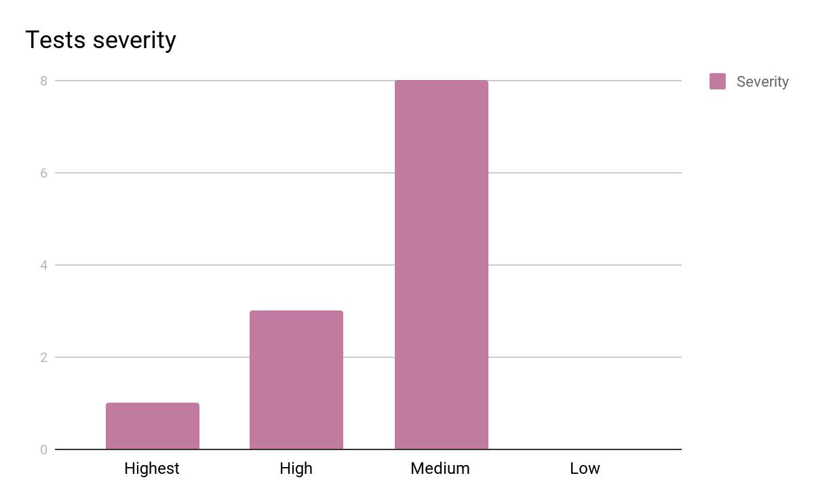

***TABLE OF CONTENTS***

Test Repost v.1.
================

1. Introduction
---------------

***Document overview***

This document is the test report of the data generator testing phase. It
consists of overall overview of how the tests were executed, tests
assessment and general test results.

2. Overview of Tests ResultsS
--------------------------------

***Tests log***

The data generator was tested on three laptops running Ubuntu 16.04.3.
The tests were executed from 07.09.2017 to 08.09.2017

The testers were:

-  Piotr Bednarz

-  Patryk Bogusz

-  Katarzyna Grzywacz

   1. .. rubric:: ***Rationale for decision***
         :name: rationale-for-decision

After executing a test, the decision is defined according to the
following rules:

-  PASSED - the test case set to “Passed” when all steps were correctly
       executed and the actual results matched the expected result

-  WORK IN PROGRESS (WIP) - the test case set to WIP when one of the
       steps does not work properly but it is easy to correct in short
       period of the time

-  FAILED - the test case set to “Failed” if the error occurs and when
       the result is not as expected

Tests results are listed in §3.

***Overall assessment of tests***

    All executed test passed and software is ready to use.

| All the exit criteria were fulfilled:
| - 100% business requirements covered
| - 100% critical defects solved
| - 100% of test cases passed

During test execution some issues were found in the application (Tests
ID: ATASCRUM1-68, ATASCRUM1-70, ATASCRUM1-61). These bugs were directly
assigned and resolved by developers team, so that at the end of sprint
Data Generator was free of bugs and ready to use.

*Number of test cases passed/failed:*

+----------------------+-----------------------+---------------------+---------------------+
| Test cases planned   | Test cases executed   | Test cases passed   | Test cases failed   |
+======================+=======================+=====================+=====================+
| 12                   | 12                    | 12                  | 0                   |
+----------------------+-----------------------+---------------------+---------------------+

*Number of tests ordered by their Status and Severity:*

+----------+-----------+--------+----------+-------+---------+
| Status   | Highest   | High   | Medium   | Low   | Total   |
+==========+===========+========+==========+=======+=========+
| Closed   | 1         | 3      | 8        | 0     | 12      |
+----------+-----------+--------+----------+-------+---------+
| Open     | 0         | 0      | 0        | 0     | 0       |
+----------+-----------+--------+----------+-------+---------+

|image0|

3. Detailed Tests Results
-----------------------------

*Defects found during tests:*

+----------------+------------------------------------------------------------------------------------------------+----------+------------+--------------+------------------------------------------------------------------------------------------+
| Issue key      | Summary                                                                                        | Status   | Priority   | Resolution   | Description                                                                              |
+================+================================================================================================+==========+============+==============+==========================================================================================+
| ATASCRUM1-80   | Minimum number of character                                                                    | Done     | High       | Done         | The application does not generate the file for minimum number of characters 1.           |
+----------------+------------------------------------------------------------------------------------------------+----------+------------+--------------+------------------------------------------------------------------------------------------+
| ATASCRUM1-79   | The app does not ask for special characters again when invalid special character is provided   | Done     | Highest    | Done         | When you provide invalid special character eg: Ä… the error message can be seen:         |
|                |                                                                                                |          |            |              |                                                                                          |
|                |                                                                                                |          |            |              | \_"Ä…" is not an ASCII character\_                                                       |
|                |                                                                                                |          |            |              |                                                                                          |
|                |                                                                                                |          |            |              | but the application is not asking for correct input and continues with next questions.   |
+----------------+------------------------------------------------------------------------------------------------+----------+------------+--------------+------------------------------------------------------------------------------------------+
| ATASCRUM1-78   | invalid handling of special chars while adding constraints for the second dictionary           | Done     | Highest    | Done         | The app crashes when adding invalid constraints to second dictionary.                    |
+----------------+------------------------------------------------------------------------------------------------+----------+------------+--------------+------------------------------------------------------------------------------------------+
| ATASCRUM1-76   | Wrong doc string format & unit tests                                                           | Done     | Medium     | Done         | Add doc strings & write unit tests                                                       |
+----------------+------------------------------------------------------------------------------------------------+----------+------------+--------------+------------------------------------------------------------------------------------------+
| ATASCRUM1-75   | Wrong doc string format & unit tests                                                           | Done     | Medium     | Done         | Code need to be repaired                                                                 |
+----------------+------------------------------------------------------------------------------------------------+----------+------------+--------------+------------------------------------------------------------------------------------------+

*Test results:*

+----------------+--------------------------------+----------+---------------------+--------------+----------------------------------------------------------------------------------------------------------------------------------------+
| Test ID        | Test case                      | Status   | Priority/Severity   | Resolution   | Description                                                                                                                            |
+================+================================+==========+=====================+==============+========================================================================================================================================+
| ATASCRUM1-74   | File format                    | Done     | Medium              | Done         | Choose the file format: csv, txt                                                                                                       |
+----------------+--------------------------------+----------+---------------------+--------------+----------------------------------------------------------------------------------------------------------------------------------------+
| ATASCRUM1-73   | Header generation              | Done     | Medium              | Done         | Checking if header is added to output file.                                                                                            |
+----------------+--------------------------------+----------+---------------------+--------------+----------------------------------------------------------------------------------------------------------------------------------------+
| ATASCRUM1-72   | Percentage of positive data    | Done     | Medium              | Done         | Choose the percentage of positive data in output file (0-100%).                                                                        |
+----------------+--------------------------------+----------+---------------------+--------------+----------------------------------------------------------------------------------------------------------------------------------------+
| ATASCRUM1-70   | Static code analysis- team 4   | Done     | Medium              | Done         | Review of code after pull request by Daria and Michal                                                                                  |
+----------------+--------------------------------+----------+---------------------+--------------+----------------------------------------------------------------------------------------------------------------------------------------+
| ATASCRUM1-69   | Static code analysis- team 3   | Done     | Medium              | Done         | Review of code after pull request from Kasia i Mat                                                                                     |
+----------------+--------------------------------+----------+---------------------+--------------+----------------------------------------------------------------------------------------------------------------------------------------+
| ATASCRUM1-68   | Static code analysis- team 2   | Done     | Medium              | Done         | Code review after pull request from team Szymon i Teresa                                                                               |
+----------------+--------------------------------+----------+---------------------+--------------+----------------------------------------------------------------------------------------------------------------------------------------+
| ATASCRUM1-66   | Correct amount of data         | Done     | Medium              | Done         | Checking if number of data in output file is the same as specified in input.                                                           |
+----------------+--------------------------------+----------+---------------------+--------------+----------------------------------------------------------------------------------------------------------------------------------------+
| ATASCRUM1-65   | special characters             | Done     | Medium              | Done         | Choose special characters from the list: [none all \` ~! @ # $ % ^ & \* ( ) \_ + - = [ ] { } \| \\ ; ‘ : “ , < . > / ?] eg.: #$%   |
+----------------+--------------------------------+----------+---------------------+--------------+----------------------------------------------------------------------------------------------------------------------------------------+
| ATASCRUM1-64   | Smoke test in valid EP         | Done     | Highest             | Done         | Test if application generates values within constraints.                                                                               |
+----------------+--------------------------------+----------+---------------------+--------------+----------------------------------------------------------------------------------------------------------------------------------------+
| ATASCRUM1-63   | Minimum smaller than maximum   | Done     | High                | Done         | To test if minimum num of char in login/pass is smaller than maximum num of char in login/pass                                         |
+----------------+--------------------------------+----------+---------------------+--------------+----------------------------------------------------------------------------------------------------------------------------------------+
| ATASCRUM1-62   | Maximum number of char         | Done     | High                | Done         | To test the maximum numb of char in login or password                                                                                  |
+----------------+--------------------------------+----------+---------------------+--------------+----------------------------------------------------------------------------------------------------------------------------------------+
| ATASCRUM1-61   | Minimum number of char         | Done     | High                | Done         | To test generation of minimum number of characters.                                                                                    |
+----------------+--------------------------------+----------+---------------------+--------------+----------------------------------------------------------------------------------------------------------------------------------------+

