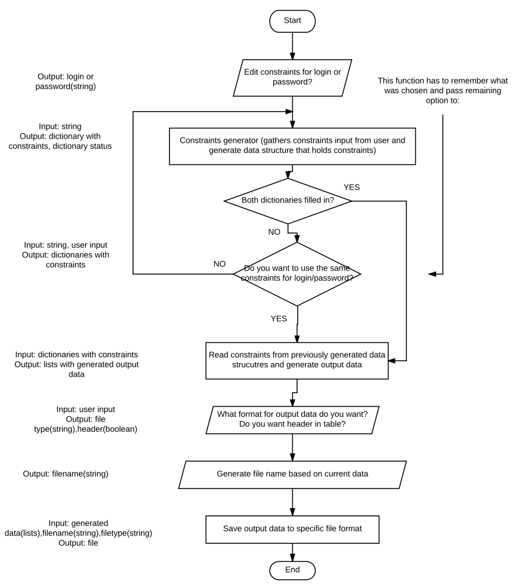

A Software Design Specification
===============================

Permission is hereby granted to make and distribute verbatim copies of this document provided the copyright notice and this permission notice are preserved on all copies.

 
1. Introduction
---------------

1.1. Document Description
~~~~~~~~~~~~~~~~~~~~~~~~~~~~

1.1.1.	Introduction
^^^^^^^^^^^^^^^^^^^^

The Software Design Document is a document to provide documentation which will be used to aid in software development of "Data generator" by providing the details for how the software should be built. Within the Software Design Document are narrative and graphical documentation of the software design for the project including use case models, sequence diagrams and other supporting requirement information.

1.1.2.	Purpose
^^^^^^^^^^^^^^^

The purpose of the Software Design Document is to provide a description of the design of a system fully enough to allow for software development to proceed with an understanding of what is to be built and how it is expected to built. The Software Design Document provides information necessary to provide description of the details for the software and system to be built.

1.1.3.	Scope
^^^^^^^^^^^^^

This Software Design Document is for "Data generator" system with a base level of functionality to show feasibility for large scale production use. This Software Design is focused on the base level system and critical parts of the system. This particular Software Design Document describes core functionality and objectives of the system. The system will be used for generating correct and incorrect logins and passwords for testing purposes. It will be used in conjunction with other pre-existing systems eg. Selenium and is aimed to speed up testing of login functionality of given website.

1.1.4.	Definitions and Acronyms
^^^^^^^^^^^^^^^^^^^^^^^^^^^^^^^^

* **PDF** - Portable Document Format 

  http://en.wikipedia.org/wiki/Portable_Document_Format
* **Required Field** - A critical field is a field in a data set for a document that is required for successful document generation. For example, missing parties in a case, missing county location of court, or other data elements that are required to create a valid legal document
* **Structured Data Format** - A structured data format is data assembled into a discernible structure, such as when data is placed into an XML instance which is validated through the use of an XML schema which defines the structure of the XML document.
* **Workflow** - The movement of documents through a work process that is structured into tasks with designated persons or systems to perform them and the definition of the order or pathway from start to finish for the work process. 

  http://en.wikipedia.org/wiki/Workflow 

1.1.5.	Reference materials
^^^^^^^^^^^^^^^^^^^^^^^^^^^

* Software Requirements Specification

1.1.6.	System Overview
^^^^^^^^^^^^^^^^^^^^^^^

Data generator system is dedicated for generating test data (login and password) for testing login functionality of given website. Main purpose of the software is to give user possibility to choose how generated logins and passwords should looks like (what characters should consist of, what should be a length and amount of those data). As an input user can choose what constraints should applied to the logins and passwords. As an output user receive text or .csv file with generated logins and passwords accordingly to chosen constraints.

2. Design Considerations
------------------------

2.1. Assumptions and Dependencies
~~~~~~~~~~~~~~~~~~~~~~~~~~~~~~~~~

* System should run on following operating systems: Linux/Unix, Windows, OsX
* Possible new functionalities can be added functionality 

2.2. General Constraints for input 
~~~~~~~~~~~~~~~~~~~~~~~~~~~~~~~~~~

Question asked when the program launches in the console:

* Do you want to choose constrains for login or password?
* Generate constrains - questions asked in the console:
	#. Minimum number of characters: (choose a number from 1 to 1000)
	#. Maximum number of characters: (choose a number from 1 to 1000)
	#. Choose special characters from the list: [none all ` ~! @ # $ % ^ & * ( ) _ + - = [ ] { } | \\ ; ' : " , < . > / ?] eg.: #$%  
	#. Do you want data to be case sensitive? [y/n] 
	#. How many sets of data do you want to generate? (choose a number from 1 to Choose percentage of positive data? 
	#. Do you want to copy constrains for login/password (depending what user has chosen before)
	#. Do you want to generate a file with headers?
	#. Choose file format: (csv/txt) 

2.3. Goals and Guidelines
~~~~~~~~~~~~~~~~~~~~~~~~~

Main goals is to create properly working data generator which works fast and reliable within given constraints.

2.4. Development Methods
~~~~~~~~~~~~~~~~~~~~~~~~

Agile SCRUM methodology. 

3. System Architecture
----------------------

 
